# 麻将馆管理系统

## 项目概述

麻将馆管理系统是基于若依（RuoYi）框架开发的一套完整的业务管理系统，采用前后端分离架构，提供会员管理、麻将桌预订、消费记录、AI智能助手等功能模块。系统支持多门店管理、积分系统、数据分析和智能客服，为麻将馆运营提供全方位的数字化解决方案。

### 技术栈

**后端技术：**
- Spring Boot 4.0.3
- Spring Security + JWT
- MyBatis
- MySQL
- Redis
- Druid 数据库连接池
- Quartz 定时任务
- Swagger/SpringDoc API 文档

**前端技术：**
- Vue 2.6.12
- Element UI 2.15.14
- Vuex
- Vue Router
- Axios
- ECharts

### 项目结构

```
bndo/
└── RuoYi-Vue/
    ├── ruoyi-admin/          # 后端启动模块
    ├── ruoyi-framework/      # 框架核心模块
    ├── ruoyi-system/         # 系统业务模块
    ├── ruoyi-quartz/         # 定时任务模块
    ├── ruoyi-generator/      # 代码生成模块
    ├── ruoyi-common/         # 通用工具模块
    └── ruoyi-ui/             # 前端模块
```

### 系统架构图

```mermaid
graph TB
    %% 定义样式
    classDef frontend fill:#e1f5ff,stroke:#3498db,stroke-width:2px;
    classDef backend fill:#fff4e1,stroke:#e67e22,stroke-width:2px;
    classDef database fill:#e8f5e9,stroke:#27ae60,stroke-width:2px;
    classDef external fill:#fce4ec,stroke:#e91e63,stroke-width:2px;

    %% 用户层
    EndUser((用户)) -->|HTTP/HTTPS| Frontend[前端应用<br/>Vue + Element UI]

    %% 前端层
    subgraph Frontend_Layer [前端层]
        Frontend --> Router[Vue Router<br/>路由管理]
        Frontend --> Store[Vuex<br/>状态管理]
        Frontend --> UI[Element UI<br/>组件库]
        Frontend --> ECharts[ECharts<br/>数据可视化]
    end

    %% 网关层
    Frontend -->|API请求| Gateway[API网关<br/>Spring Boot]

    %% 后端层
    subgraph Backend_Layer [后端业务层]
        Gateway --> Security[Spring Security<br/>认证授权]
        Gateway --> Framework[ruoyi-framework<br/>框架核心]
        
        Framework --> Business[ruoyi-system<br/>业务系统]
        Framework --> Quartz[ruoyi-quartz<br/>定时任务]
        Framework --> Generator[ruoyi-generator<br/>代码生成]
        Framework --> Common[ruoyi-common<br/>通用工具]
        
        %% 业务模块
        subgraph Business_Modules [业务模块]
            Business --> System[系统管理模块]
            Business --> Mahjong[麻将馆业务模块]
            Business --> AI[AI智能服务模块]
            Business --> Monitor[系统监控模块]
            Business --> Tool[系统工具模块]
        end
        
        %% 系统管理模块详情
        subgraph System_Detail [系统管理]
            System --> SysUser[用户管理]
            System --> Role[角色管理]
            System --> Menu[菜单管理]
            System --> Dept[部门管理]
            System --> Post[岗位管理]
            System --> Dict[字典管理]
            System --> Config[参数配置]
            System --> Notice[通知公告]
        end
        
        %% 麻将馆业务模块详情
        subgraph Mahjong_Detail [麻将馆业务]
            Mahjong --> StoreMgmt[门店管理]
            Mahjong --> TableMgmt[麻将桌管理]
            Mahjong --> TableType[麻将桌类型]
            Mahjong --> PlayerMgmt[玩家管理]
            Mahjong --> MemberMgmt[会员管理]
            Mahjong --> MemberLevel[会员等级]
            Mahjong --> ReservationMgmt[预订管理]
            Mahjong --> ConsumeMgmt[消费管理]
            Mahjong --> PointsMgmt[积分系统]
            Mahjong --> PointsLog[积分日志]
            Mahjong --> ReviewMgmt[评价管理]
        end
        
        %% AI智能服务模块详情
        subgraph AI_Detail [AI智能服务]
            AI --> Chat[AI智能助手]
            AI --> Knowledge[知识管理]
            AI --> Intent[意图识别]
            AI --> Recommend[AI推荐]
            AI --> Analysis[数据分析]
        end
        
        %% 系统监控模块详情
        subgraph Monitor_Detail [系统监控]
            Monitor --> Online[在线用户]
            Monitor --> JobLog[定时任务日志]
            Monitor --> Druid[Druid监控]
            Monitor --> Server[服务监控]
            Monitor --> Cache[缓存监控]
            Monitor --> OperLog[操作日志]
            Monitor --> LoginLog[登录日志]
        end
        
        %% 系统工具模块详情
        subgraph Tool_Detail [系统工具]
            Tool --> Form[表单构建]
            Tool --> CodeGen[代码生成]
            Tool --> Swagger[Swagger接口]
        end
    end

    %% 数据层
    subgraph Data_Layer [数据层]
        Business --> MySQL[(MySQL数据库)]
        Business --> Redis[(Redis缓存)]
    end

    %% 外部服务
    subgraph External_Services [外部服务]
        AI --> DeepSeek[DeepSeek API<br/>AI服务]
    end

    %% 应用样式
    class Frontend,Router,Store,UI,ECharts frontend;
    class Gateway,Security,Framework,Business,Quartz,Generator,Common backend;
    class System,Mahjong,AI,Monitor,Tool backend;
    class SysUser,Role,Menu,Dept,Post,Dict,Config,Notice backend;
    class StoreMgmt,TableMgmt,TableType,PlayerMgmt,MemberMgmt,MemberLevel backend;
    class ReservationMgmt,ConsumeMgmt,PointsMgmt,PointsLog,ReviewMgmt backend;
    class Chat,Knowledge,Intent,Recommend,Analysis backend;
    class Online,JobLog,Druid,Server,Cache,OperLog,LoginLog backend;
    class Form,CodeGen,Swagger backend;
    class MySQL,Redis database;
    class DeepSeek external;
```



### 架构说明

#### 1. 前后端分离架构
系统采用典型的前后端分离架构，前端使用Vue.js技术栈，后端使用Spring Boot技术栈，通过RESTful API进行通信。

#### 2. 层次结构
- **用户层**：最终用户通过浏览器访问系统
- **前端层**：负责页面展示和用户交互，使用Vue 2 + Element UI
- **网关层**：Spring Boot提供API接口服务
- **业务层**：包含多个功能模块，实现具体业务逻辑
- **数据层**：MySQL作为主数据库，Redis作为缓存
- **外部服务**：集成DeepSeek AI服务

#### 3. 核心模块关系
- **ruoyi-admin**：作为启动模块，集成其他模块
- **ruoyi-framework**：提供框架核心功能，被其他模块依赖
- **ruoyi-system**：包含核心业务逻辑
- **ruoyi-common**：提供通用工具类，被所有模块使用

### 麻将馆业务模块完整性检查

✅ **已包含的麻将馆业务模块**：
1. 门店管理
2. 麻将桌管理
3. 麻将桌类型
4. 玩家管理
5. 会员管理
6. 会员等级
7. 预订管理
8. 消费管理
9. 积分系统
10. 积分日志
11. 评价管理

### 导出高清架构图

为了方便在文档和演示中使用高质量的架构图，我们提供了专门的导出工具：

**操作步骤**：
1. 在项目根目录找到 `architecture-diagram.html` 文件
2. 使用现代浏览器（Chrome、Firefox、Edge等）打开该文件
3. 等待架构图自动渲染完成
4. 点击页面上方的 **"📥 导出为PNG图片"** 按钮
5. 系统会自动下载高质量（2倍分辨率）的PNG图片到本地

**导出的图片特点**：
- 高分辨率，清晰可辨
- 白色背景，适合打印和文档使用
- 包含完整的图例说明
- 文件命名规范：`麻将馆管理系统架构图.png`

**备选方案**：
- 如果需要矢量格式，可以点击 **"📥 导出为SVG图片"** 按钮
- SVG格式支持无限缩放，适合专业设计软件编辑

**在线渲染**：
- README中的Mermaid代码可以在支持Mermaid的Markdown查看器（如GitHub、GitLab、VS Code等）中直接显示
- 如需临时查看，也可以访问 [Mermaid Live Editor](https://mermaid.live/) 粘贴代码进行预览

## 核心功能

### 1. 系统管理
- **用户管理**：系统用户的增删改查和权限分配
- **角色管理**：角色权限配置和数据权限控制
- **菜单管理**：系统菜单和按钮权限配置
- **部门管理**：组织机构树状管理
- **岗位管理**：用户岗位配置
- **字典管理**：系统常用参数维护
- **参数设置**：系统动态参数配置
- **通知公告**：系统公告发布管理

### 2. 麻将馆业务管理
- **门店管理**：多门店信息管理
- **麻将桌管理**：麻将桌信息、类型、状态管理
- **麻将桌类型**：麻将桌分类（自动麻将桌、手动麻将桌等）
- **玩家管理**：顾客玩家信息管理
- **会员管理**：会员等级、会员信息管理
- **预订管理**：麻将桌在线预订功能
- **消费管理**：消费记录、账单管理
- **积分系统**：积分获取、消费、日志查询
- **评价管理**：顾客评价功能

### 3. AI 智能服务
- **AI 智能助手**：基于 DeepSeek 的智能客服
- **知识管理**：AI 知识库配置
- **意图识别**：用户意图智能识别
- **AI 推荐**：智能推荐功能
- **数据分析**：AI 辅助数据分析

### 4. 系统监控
- **在线用户**：当前在线用户监控
- **定时任务**：定时任务配置和执行日志
- **数据监控**：Druid 数据库监控
- **服务监控**：服务器性能监控
- **缓存监控**：Redis 缓存监控
- **操作日志**：系统操作日志记录
- **登录日志**：用户登录日志记录

### 5. 系统工具
- **表单构建**：在线表单设计器
- **代码生成**：前后端代码一键生成
- **系统接口**：Swagger API 文档

## 安装教程

### 环境要求

| 组件 | 版本要求 |
|------|----------|
| JDK | 17+ |
| Node.js | >= 8.9 |
| MySQL | 5.7+ |
| Redis | 5.0+ |
| Maven | 3.6+ |

### 后端安装

1. **克隆项目**
```bash
git clone <repository-url>
cd bndo/RuoYi-Vue
```

2. **创建数据库**
```sql
CREATE DATABASE ry-vue DEFAULT CHARACTER SET utf8mb4 COLLATE utf8mb4_general_ci;
```

3. **导入数据库脚本**
执行项目中的 SQL 脚本文件初始化数据库

4. **修改配置文件**
编辑 `ruoyi-admin/src/main/resources/application-druid.yml`，配置数据库和 Redis 连接信息：
```yaml
spring:
  datasource:
    type: com.alibaba.druid.pool.DruidDataSource
    driver-class-name: com.mysql.cj.jdbc.Driver
    url: jdbc:mysql://localhost:3306/ry-vue?useUnicode=true&characterEncoding=utf8&zeroDateTimeBehavior=convertToNull&useSSL=true&serverTimezone=GMT%2B8
    username: root
    password: your_password
  data:
    redis:
      host: localhost
      port: 6379
      password:
      database: 0
```

5. **编译打包**
```bash
mvn clean package
```

6. **启动项目**
```bash
cd ruoyi-admin
mvn spring-boot:run
```

### 前端安装

1. **进入前端目录**
```bash
cd ruoyi-ui
```

2. **安装依赖**
```bash
npm install
```

3. **修改配置**
编辑 `.env.development` 和 `.env.production` 文件，配置后端 API 地址

4. **启动开发服务器**
```bash
npm run dev
```

5. **构建生产版本**
```bash
npm run build:prod
```

## 配置说明

### 后端配置

主要配置文件：
- `application.yml` - 主配置文件
- `application-druid.yml` - 数据库和 Redis 配置

**关键配置项：**

```yaml
# 项目配置
ruoyi:
  name: RuoYi
  version: 3.9.2
  profile: D:/ruoyi/uploadPath  # 文件上传路径

# 服务器配置
server:
  port: 8080

# Token 配置
token:
  header: Authorization
  secret: abcdefghijklmnopqrstuvwxyz
  expireTime: 30

# DeepSeek AI 配置
deepseek:
  api-key: your_api_key
  api-url: https://api.deepseek.com/chat/completions
  model: deepseek-chat
  timeout: 30000
```

### 前端配置

环境配置文件：
- `.env.development` - 开发环境
- `.env.production` - 生产环境
- `.env.staging` - 测试环境

```env
# 开发环境配置
VUE_APP_BASE_API = 'http://localhost:8080'
```

## 使用示例

### 1. 登录系统

访问 `http://localhost:80`（前端）或 `http://localhost:8080`（后端），使用默认账号登录：
- 用户名：`admin`
- 密码：`admin123`

### 2. 添加门店

1. 进入「系统管理」→「门店管理」
2. 点击「新增」按钮
3. 填写门店信息（名称、地址、联系方式等）
4. 点击「确定」保存

### 3. 管理麻将桌

1. 进入「麻将馆管理」→「麻将桌管理」
2. 点击「新增」添加麻将桌
3. 选择麻将桌类型、所属门店、设置小时费率
4. 保存后可在列表中查看和管理麻将桌状态

### 4. 麻将桌预订

1. 进入「麻将馆管理」→「预订管理」
2. 点击「新增预订」
3. 选择玩家、麻将桌、预订时间
4. 确认后完成预订

### 5. 消费结算

1. 进入「麻将馆管理」→「消费管理」
2. 选择在使用的麻将桌
3. 填写消费信息（时长、商品消费等）
4. 结算后自动生成消费记录和积分

## API 文档

### Swagger 文档

项目启动后访问：`http://localhost:8080/swagger-ui.html`

### 主要 API 接口

#### 认证接口

| 方法 | 路径 | 说明 |
|------|------|------|
| POST | `/login` | 用户登录 |
| POST | `/logout` | 用户退出 |
| GET | `/getInfo` | 获取用户信息 |
| GET | `/getRouters` | 获取路由信息 |

#### 门店管理

| 方法 | 路径 | 说明 |
|------|------|------|
| GET | `/system/store/list` | 查询门店列表 |
| GET | `/system/store/{id}` | 获取门店详情 |
| POST | `/system/store` | 新增门店 |
| PUT | `/system/store` | 修改门店 |
| DELETE | `/system/store/{ids}` | 删除门店 |

#### 麻将桌管理

| 方法 | 路径 | 说明 |
|------|------|------|
| GET | `/system/tableInfo/list` | 查询麻将桌列表 |
| GET | `/system/tableInfo/{id}` | 获取麻将桌详情 |
| POST | `/system/tableInfo` | 新增麻将桌 |
| PUT | `/system/tableInfo` | 修改麻将桌 |
| DELETE | `/system/tableInfo/{ids}` | 删除麻将桌 |

#### 预订管理

| 方法 | 路径 | 说明 |
|------|------|------|
| GET | `/system/reservation/list` | 查询预订列表 |
| GET | `/system/reservation/{id}` | 获取预订详情 |
| POST | `/system/reservation` | 新增预订 |
| PUT | `/system/reservation` | 修改预订 |
| DELETE | `/system/reservation/{ids}` | 删除预订 |

#### 消费管理

| 方法 | 路径 | 说明 |
|------|------|------|
| GET | `/system/consume/list` | 查询消费记录 |
| GET | `/system/consume/{id}` | 获取消费详情 |
| POST | `/system/consume` | 新增消费 |
| PUT | `/system/consume` | 修改消费 |
| DELETE | `/system/consume/{ids}` | 删除消费 |

#### AI 接口

| 方法 | 路径 | 说明 |
|------|------|------|
| POST | `/system/ai/chat` | AI 对话 |
| POST | `/system/ai/recommend` | 获取 AI 推荐 |
| GET | `/system/ai/history` | 获取对话历史 |

## 贡献指南

欢迎贡献代码！请遵循以下步骤：

1. **Fork 项目**
   在 GitHub 上 Fork 本仓库

2. **创建分支**
   ```bash
   git checkout -b feature/your-feature
   ```

3. **提交更改**
   ```bash
   git commit -m 'Add some feature'
   ```

4. **推送到分支**
   ```bash
   git push origin feature/your-feature
   ```

5. **创建 Pull Request**
   提交 PR 等待审核

### 代码规范

- 后端遵循阿里巴巴 Java 开发规范
- 前端遵循 Vue 风格指南
- 提交信息使用清晰的描述
- 确保代码通过 CI 检查

## 许可协议

本项目基于 RuoYi 框架开发，遵循 MIT 开源协议。

## 问题排查

### 常见问题

1. **后端启动失败**
   - 检查 MySQL 和 Redis 是否正常启动
   - 确认数据库连接配置正确
   - 检查端口 8080 是否被占用

2. **前端无法访问后端**
   - 确认后端服务已启动
   - 检查前端配置的 API 地址是否正确
   - 查看浏览器控制台错误信息

3. **登录失败**
   - 确认数据库中有正确的用户数据
   - 检查验证码配置
   - 查看后端日志排查原因

4. **AI 功能不可用**
   - 确认 DeepSeek API Key 配置正确
   - 检查网络连接是否正常
   - 查看 API 调用日志

5. **文件上传失败**
   - 检查上传路径配置是否正确
   - 确认目录有写入权限
   - 检查文件大小限制

### 获取帮助

如遇到问题，请：
1. 查看项目日志文件
2. 检查 GitHub Issues 是否有类似问题
3. 提交新的 Issue 并附上详细错误信息

---

**项目版本：** 3.9.2  
**最后更新：** 2026-05-31  
**官方文档：** http://doc.ruoyi.vip
